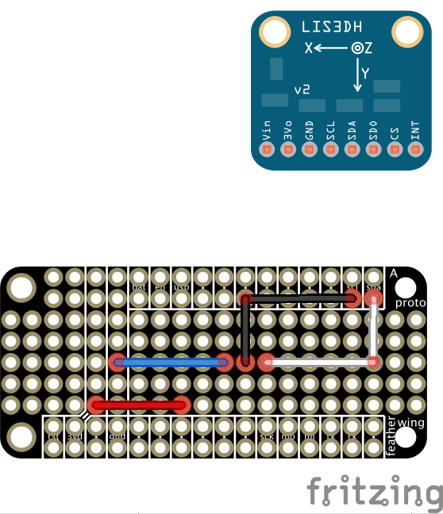
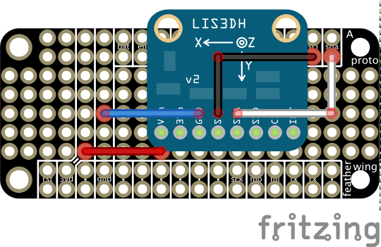
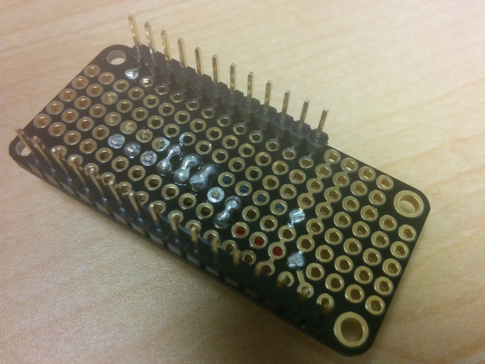
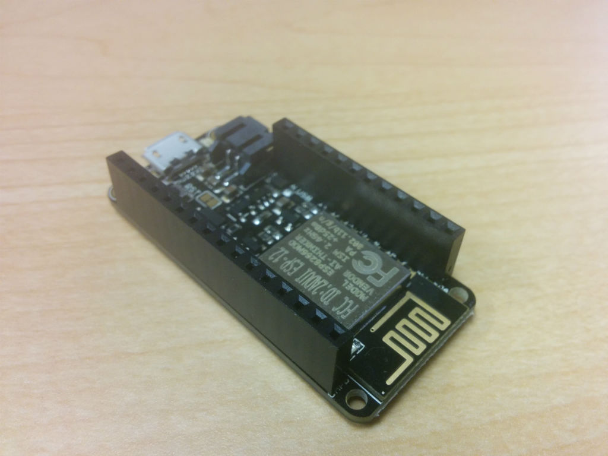
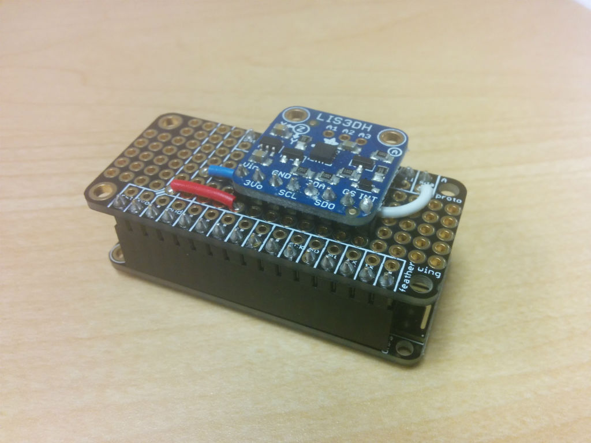

# Assembly Instructions

### Introduction

Once you have the materials, you will be constructing two components. One is the Adafruit Feather Huzzah controller and the other is the Featherwing add-on board with the accelerometer. You will need:

- Soldering iron
- Solder
- Wire cutters
- Wire strippers
- 22 AWG hook-up wire

If you have a multi-meter, you can use it to check your work. A video will be posted demonstrating the entire process

### Featherwing Accelerometer Add-On Board

__*Step 1*__

Solder the male header pins onto the Featherwing Proto board. The easiest way to do it is to insert the male header pins into a breadboard to hold them in place, fit the proto board to the top of the male header pins, and then perform your soldering. 

__*Step 2*__

Cut and trim hook-up wire and solder them in place onto the proto board. Here is the wiring diagram:

__*Step 3*__

Solder the male header pins onto the accelerometer breakout. Once you have done so, place the breakout on the proto board *above* the wires. Turn the board over and solder it into place. (The placement diagram below appears to show the board below the wires -- this is due to a bug in Fritzing.)

__*Step 4*__

Turn the proto board over. Clip off all of the excess wire and pins in the center of the board from the accelerometer and the hook-up wires. After that, solder a trace from each accelerometer pin to the matching wire next to it.

### Adafruit Feather Huzzah Assembly

The next component is relatively straightforward to assemble. You must solder the female header onto the Adafruit Feather Huzzah. The easiest way to do that is to place the female headers onto the male header pins on the add-on board, position the Feather Huzzah onto the female headers, and then solder them in place.

### You're finished!

Some additional notes - If you are attaching a LiPo battery, keep in mind that the battery itself is a little fragile and prone to heating up quickly under usage. Make sure that there is material separating the pin headers on the Accelerometer from the battery itself, to avoid puncturing the battery during use or abuse. A small project box is highly recommended for safety.